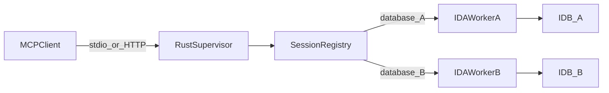

# Architecture

`ida-headless-mcp` is split into two runtime roles implemented by the same
binary:

- The supervisor owns MCP transports, the advertised tool catalog, output caching,
  and the mapping from public `database` session IDs to workers.
- A worker loads exactly one matching IDA runtime and serializes every SDK call
  on IDA's main thread.

One IDA process cannot safely own multiple active databases. Multi-session
support therefore uses process isolation rather than switching a global IDB in
one process.

## Session invariants

- `idb_open` returns an opaque random session ID. A path is never accepted as
  a substitute for that ID.
- Every non-management tool requires `database`.
- The same canonical database path is adopted instead of opened twice.
- A worker is never shared by two database sessions.
- `idb_close` optionally saves before releasing the worker and file lock.
- Worker failure invalidates only its own session.
- Idle workers have a bounded lifetime; the default is 600 seconds.

## SDK versions

Builds select exactly one of `ida-92`, `ida-93`, or `ida-94`. The selected
feature pins the matching `idalib` branch and the executable checks the loaded
IDA minor before opening a database. Runtime libraries and SDK files are not
part of release archives.

Versioning is three independent numbers, not one:

- Crate `version` (currently `0.1.0`) is the product version.
- `COMPILED_IDA_VERSION` is the IDA minor this binary was linked against.
- Release tags are `v${product version}` (for example `v0.1.0`), not `v9.4.x`.

`idalib` supplies the main safe Rust API. Operations that it does not expose
yet—database saves, code/function definition, operand display types, enum and
variable edits, decompiler cache invalidation, and signature operand masks—go
through `src/ida_sdk_bridge.cpp`. The bridge exports a narrow C ABI, is compiled
against the selected SDK, and is exercised by all three SDK-manifest builds.

## Compatibility boundary

The public contract is pinned to `mrexodia/ida-pro-mcp` commit
`0b5f7ae4026d3c770b190ca93c0692d1b0ceab22`. Debugger and GUI discovery tools
are intentionally outside the headless boundary. See `MIGRATION.md`.
